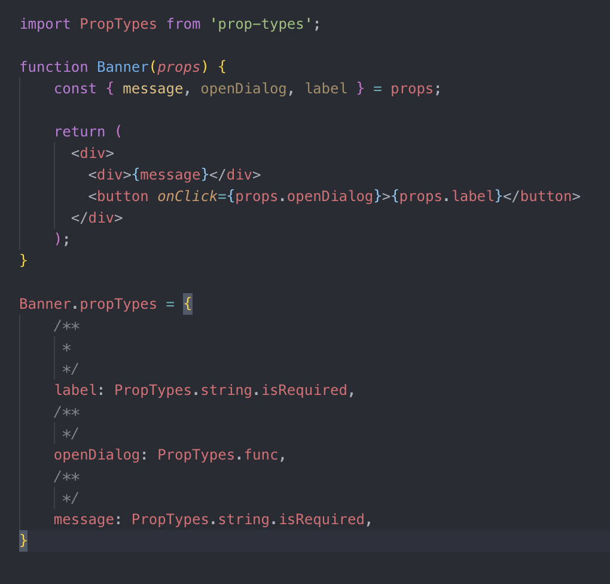

# Component Way

## План
 * Что такое компонентный подход
 * Что предоставляет библиотека React?
 * Как выглядит React Component
 * Что такое React Element
 * Какие способы стилизации компонентов можно применить?
 * Что такое state и что такое props?
 * Виды компонентов (functional, class || smart, dumb || statefull vs stateless)
 * Древовидность компонентов


 ### Что такое компонентный подход

 Цель веб-компонентов в уменьшении сложности за счет изоляции связанных групп кода на HTML, CSS и JavaScript для выполнения общей функциональности в пределах контекста.

    ```
        То есть например, у нас есть кнопка (это отдельный компонент) его можно инкапсулировать в единый компонент, который будет иметь свой JS, свои стили и свой mark-up
    ```

 ### Что предоставляет библиотека React?

    Это библиотека, которая позволит вам организовать ваши View. Не более того, всё остальное необходимо будет подключать:
        1) UI Kit
        2) Сторонние компоненты
        3) Работа с состоянием приложения в целом
        4) Нет реактивности, надо самим если необходимо организовывать

 ### Как выглядит React Component
  
  
 ### Какие способы стилизации компонентов можно применить?
 
   1) Классический способ: 
        1.1) Навешиваем классы на элементы. (в частности BEM)
        1.2) Создаем стили в отдельных файлах.
        1.3) Импортируем файл со стилями в код
        
        Плюсы: 
            простота; 
            нативность
        Минусы: 
            проблемы с именами классов и пересекающимися стилями, которые приходится решать самостоятельно
        
   2) CSS модули:
        2.1) Создаем стили в отдельном файле.
        2.2) В файле компонента импортируем стили как целый объект (styles)
        2.3) На реакт-элементах в className передаем через '.' имена классов из объекта: styles.header
        2.4) В дальнейшем при помощи сборщика проектов (e.g. webpack) и специальных конфигураций имена классов хэширутся предотвращая столкновение стилей (в большей части случаев)
        
        Плюсы: 
            практическая псевдоизолированность; 
            возможность не думать о весах селекторов и пересекающихся именах;
        Минусы: 
            более сложное восприятие стилей в DOM при отладке; 
            требует полностью компонентного хода мышления при разработке; 
        
   3) Инлайновые стили:
        3.1) Создаем объекты стилей в файлах компонентов.
        3.2) Далее передаем их в атрибут style на реакт-элементе.
        
        Плюсы: 
            читабельность и привязанность стилей к компоненту;
            неперебиваемость;
        Минусы: 
            неразделенность стилей и компонента; 
            неперебиваемость;
        
   4) CSS in JS при помощи сторонних библиотек (styled-components || emotion || ...)
        4.1) Создаем стилестические врапперы как раект компоненты, который инкпасулируют специфические стили.
        4.2) Применям их в наших реакт компонентах в композиционной манере.
        
        Плюсы: 
            атомарность; 
            псевдоизолированность стилей; 
            возможность не думать о весах селекторах и пересекающихся именах; 
            возможность использовать темы из коробки; 
            возможность влиять на стили при помоци пропсов из коробки;
        Минусы: 
            требуется специальная библиотека, которая имеет свой уровень поддержки и релизы; 
            написание стилей в немного непривычной манере;
    
    
       Сборщик проекта (вроде webpack) при помощи специальных лоадеров парсит less/scss, применяя на лету разне рулы (postCSS) 

 ### Что такое React Element
 
 Элемент описывает то, что вы хотите увидеть на экране.
 
 К примеру:
 ```
   <h1>Hello, world</h1>;
 ```
 
 В отличие от DOM-элементов, элементы React — это простые неизменяемые (имутабельные) объекты. React DOM обновляет DOM, чтобы он соответствовал переданным React-элементам. Любые ваши компоненты состоят из React-element или других компонентов. 
 
 React-factory - функции, которые позволяют легко создавать React-element.
 
 
  ### Что такое state и что такое props
  
Props - параметры, которые принимает компонент. Давайте рассмотрим пример:


Как вы видите в примере, используется объект props из которого берутся значения: label и функция (callback) onCHange. Переданы эти параметры из вышестоящего компонента, который передал в этот определенные параметры для работы с ним. Props следует называть так, чтобы они имели смысл в первую очередь с точки зрения функционального назначения.

Компонент никогда не должен что-то записывать в свои props — вне зависимости от того, функциональный он или классовый. Props нужны только для чтения. То есть по факту: React-component обязаны вести себя как чистые функции по отношению к своим пропсам.

Важно знать, что props можно проверять на тип, используя PropTypes. PropTypes предоставляет ряд валидаторов, которые могут использоваться для проверки, что получаемые данные корректны. В примере мы использовали PropTypes.string и PropTypes.func. Когда какой-то prop имеет некорректное значение, в консоли будет выведено предупреждение. По соображениям производительности propTypes проверяются только в режиме разработки.

Давайте рассмотрим пример:



Cтоит обратить внимание на .isRequired - эти поля обязательны, и будут выводить ошибку в консоль, если их не передать.Также вы можете задать значения по умолчанию для ваших props с помощью специального свойства defaultProps. В нашем случае это выглядело бы так:

 ```
   Banner.defaultProps = {
       message: 'Problem'
   };
 ```
